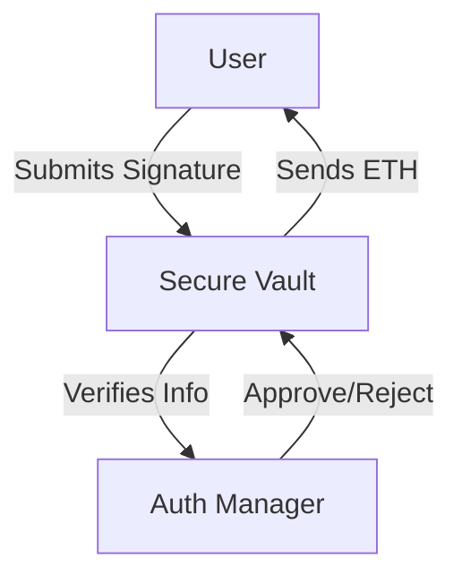

# Secure Vault System 

Hi there! This is my implementation of a **Secure Vault** system. The goal was to build a decentralized way to hold funds where withdrawals are only possible if an off-chain administrator "signs off" on them first.

Instead of putting all the logic in one massive file, I split it into two smart contracts to keep things clean and secure: one that holds the money (Vault) and one that checks the signatures (Auth Manager).

---

##  How It Works (The Flow)

The system is designed to be simple but strict. Here is the lifecycle of a withdrawal:

1.  **Off-Chain:** The Admin generates a cryptographic signature that says: *"I approve User X to withdraw 1 ETH with ID #123 from Vault A."*
2.  **On-Chain:** The User takes that signature and calls the `withdraw` function on the Vault.
3.  **Verification:** The Vault asks the Auth Manager: *"Is this signature valid? And has this ID #123 been used before?"*
4.  **Action:**
    * If **Yes**: The Auth Manager marks ID #123 as "used" forever, and the Vault sends the money.
    * If **No**: The transaction fails immediately.



---

## 🛠️ Tech Stack & Setup

I used **Docker** to containerize the whole environment. This means you don't need to struggle with installing Hardhat or Node.js locally—it just runs in an isolated box.

### Quick Start

To spin up the local blockchain and deploy the contracts, just run:

```bash
docker-compose up --build

```

You'll see the **Chain ID (1337)** and the contract addresses pop up in your terminal.

### Running Tests

I wrote automated tests to prove the security features work (like blocking replay attacks). While the Docker container is running, open a new terminal and run:

```bash
# Replace 'secure-vault-system-1' with your container name if different
docker exec -it secure-vault-system-1 npx hardhat test tests/system.spec.js

```

---

## Security Decisions

I had to make a few key design choices to keep this secure:

* **Replay Protection:** I used a `mapping` to track every authorization ID (nonce). Once an ID is used, it's burned. This stops someone from spamming the same valid signature to drain the vault.
* **Separation of Concerns:** By keeping the signature logic in a separate contract (`AuthorizationManager`), the Vault contract stays incredibly simple. Simple code = fewer bugs = safer funds.
* **Context Binding:** The signature includes the specific address of the Vault. This prevents a "Cross-Vault" attack where a hacker takes a signature meant for *Vault A* and tries to use it on *Vault B*.

---

## 📂 Project Structure

* `contracts/` - The Solidity smart contracts.
* `tests/` - The scripts that verify valid/invalid withdrawals.
* `docker/` - Configuration to run this anywhere without setup headaches.
